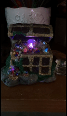

# 💎 TreasureGemEngine  
_A cinematic LED engine powering multi-cluster gemstone lighting with shimmer, flares, hue drift, and breathing effects — running on Adafruit NeoPixels with flawless timing and color control._

<div align="center">


</div>

---

## ✨ Animated Showcase  

<p align="center">
  
</p>
</div>

---

## 🚀 Overview  
TreasureGemEngine is a **class-based LED rendering engine** designed for clustered gemstones, jewel lighting, and high-end display cases.  
The engine recreates natural gem behaviors:

- **Facet-based shimmer**
- **Breathing luminosity curves**
- **Randomized spark flares**
- **Dynamic hue drifting**
- **Cluster-level state modeling**
- **White-mode spectral bursts**
- **Full timing integrity preserved from the Arduino prototype**

Every LED is treated as a surface facet — giving the impression of depth, internal color refraction, and living crystal behavior.

---

## 🔥 Feature Set

### **Clustered Gem Layout**
- 7 clusters (2–3 LEDs each)
- Independent hue drift and facet angle
- Per-cluster flash waves  
- Per-LED random jitter modulation

### **Cinematic Lighting Engine**
- Multi-mode color cycling  
- White-mode “pure crystal” phase  
- Breathing modulation overlay  
- 2× speed enhancements for sparkle & flare timing  
- Palette resets to avoid color stagnation

### **High-Resolution LED Math**
- HSV → RGB conversion with physical-style falloff  
- Gamma-adjusted brightness curves  
- Specular highlight approximation  
- Facet cosine modeling

### **Gem Shimmer Physics**
- Sine-wave and triangular flash modes  
- Intensity envelope shaping  
- Directional hue twisting on flash events  
- Felt-motion jitter applied at both:
  - Cluster level
  - LED level

---

## 📁 Project Structure

```
TreasureGemEngine/
│
├── assets/
│   └── demo.gif
│
└── src/
    ├── led_engine.h        # Class interface
    ├── led_engine.cpp      # Full engine implementation
    └── main.cpp            # Arduino / PlatformIO entrypoint
```

---

## ⚙️ Technology Stack

- **C++17** (PlatformIO / Arduino)
- **Adafruit NeoPixel Library**
- **GRBW LEDs** (800 kHz)
- **Class-based engine architecture** (JinxLED style)
- **Precision timing via millis()**
- **Deterministic hue + brightness math**

---

## 🔌 Wiring  
- **LED_PIN:** 4  
- **LED Type:** NeoPixel GRBW  
- **LED Count:** 15  
- **Power:** Use a proper 5V regulated supply (not USB), especially under full sparkle load.

---

## 🧠 Engine Class Usage

```cpp
#include "led_engine.h"

LedEngine engine;

void setup() {
    engine.begin();
}

void loop() {
    engine.update();
}
```

The engine internally manages:

- Palette resets  
- Flash timers  
- Cluster states  
- Breathing curve  
- Spectral white mode  
- Pixel writes + color math  

You only call **begin()** and **update()** — the entire cinematic system runs automatically.

---

## 📜 License  
Creative project by **Shawna Flannigan** — part of the Shawna LED Engine Collection.

---

## 💬 Feedback / Contributions  
If you're building a LED statue, gem chest, or display case:  
```
